# ANÁLISIS UNIVARIABLE: VARIABLES NUMÉRICAS

## 1- Precios y Coste del Flete:

Precios: Existen valores atípicos significativos, con un precio máximo de 6735 BRL, mientras que un precio se considera atípico si supera los 280. La mediana de los precios está entre 39 y 134, con un promedio de 120.

Coste del Flete: Existen valores atípicos, el valor máximo registrado es 409 BRL. La media del coste del flete es de 19,99, y la mitad de los valores se sitúan entre 13 y 21. El valor máximo registrado es 409, indicando la presencia de algunos valores atípicos elevados.

Media de 'price': 120.65373901464716
Mediana de 'price': 74.99
Moda de 'price': 59.9

Media de 'freight_value': 19.990319928983578
Mediana de 'freight_value': 16.26
Moda de 'freight_value': 15.1

## 2- Plazos de Pago:

La media de los plazos de pago es de 2,85 cuotas, y la mayoría de los clientes elige entre 1 y 4 plazos por pedido. Los plazos van desde un mínimo de 1 hasta un máximo de 24.

## 3- Tipos de Pago:

 payment_type  cantidad_transacciones  porcentaje
       boleto                   19784   19.043952
  credit_card                   76795   73.922376
   debit_card                    1529    1.471806
  not_defined                       3    0.002888
      voucher                    5775    5.558978

## 4- Valor de los Pagos:

La media del valor de los pagos es 154,10 BRL, con una desviación estándar notable de 217,49. La mayoría de los pagos están entre 56 y 171, mientras que un valor máximo de 13.664,08 BRL representa un outlier significativo.

En relación al valor del pago (payment value), se observa que la media de todos los pagos es de 154,10 BRL, con una desviación estándar de 217,49. La mitad de los valores oscila entre 56 y 171, mientras que el valor máximo registrado es 13.664,08 BRL, lo que lo convierte en un outlier significativo.

## 5- Puntuaciones de las Reseñas:

La media de las puntuaciones es 4,09, con la mayoría de las reseñas en el rango de 4 a 5. La puntuación más frecuente es 5, con cerca de 60.000 apariciones, y la puntuación menos común es 2.

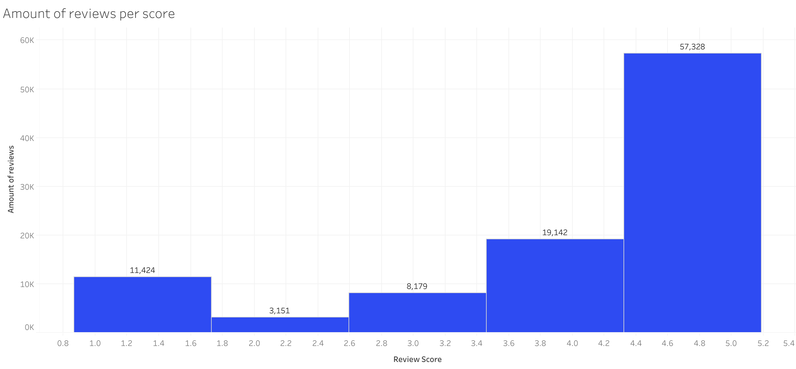
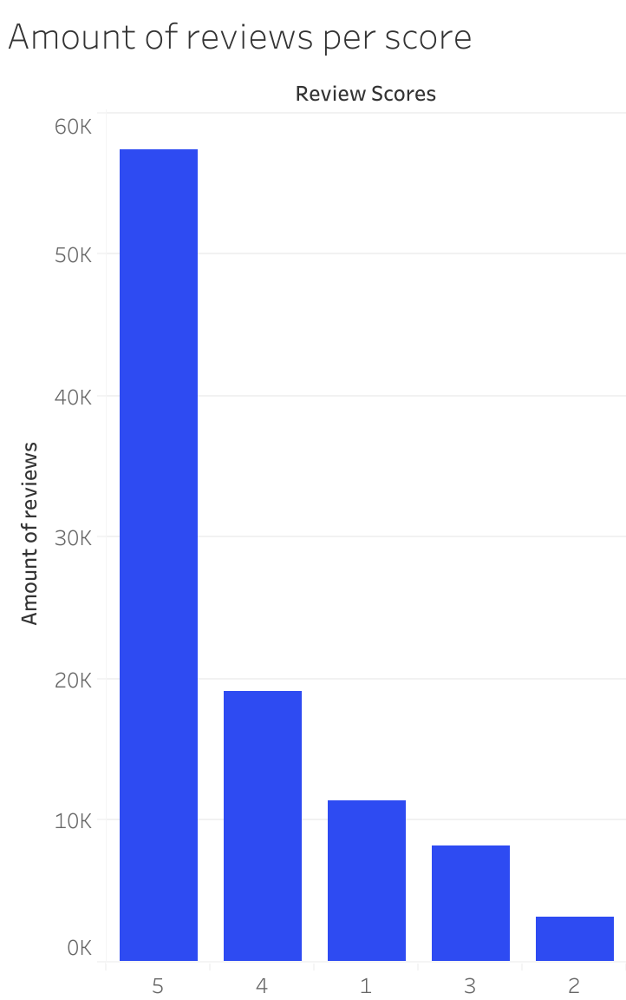

## 6- Largo del Nombre de los Productos:

Los nombres de los productos tienen una media de 48,5 caracteres. Los valores más comunes oscilan entre 50 y 60 caracteres, indicando que la mayoría de los nombres se encuentran en este rango.

## 7- Largo de la Descripción de los Productos:

La media de caracteres en las descripciones es 772, con la mayoría de las descripciones entre 0 y 1000 caracteres. La frecuencia de productos con descripciones más largas disminuye significativamente a partir de los 1000 caracteres, y hay algunos outliers con más de 4000 caracteres.

## 8- Cantidad de Fotos por Producto:

La media de fotos por producto es 2,19, siendo 1 foto la más frecuente. La mitad de los productos tienen entre 1 y 3 fotos, con un valor máximo atípico de 20 fotos.

## 9- Peso de los Productos:

El peso promedio de los productos es 2.276,96 gramos. El rango intercuartílico muestra que los pesos varían entre 300 y 1.900 gramos. El valor máximo registrado es 40.425 gramos, indicando un peso considerablemente alto para algunos productos.

## 10- Largura de los Productos:

La longitud media de los productos es 30,85 cm, con un mínimo de 7 cm y un máximo de 105 cm. La mitad de los productos tienen una longitud entre 18 y 38 cm.

## 11- Altura de los Productos:

La altura promedio es 16,96 cm. Los valores varían de un mínimo de 2 cm a un máximo de 105 cm, con la mayoría de los productos teniendo una altura entre 8 y 21 cm.

## 12- Anchura de los Productos:

La media de la anchura es 23,21 cm, con un mínimo de 6 cm y un máximo de 118 cm. La mitad de los productos tienen una anchura entre 15 y 30 cm.

## 13- Análisis de descripciones:

1- Distribución del Largo del Nombre de los Productos: El primer gráfico ilustra la distribución del número de caracteres en los nombres de los productos. La media de caracteres es de 48,5, y los valores más frecuentes se encuentran entre 50 y 60 caracteres.

2- Distribución del Largo de la Descripción de los Productos: El segundo gráfico muestra la distribución del número de caracteres en las descripciones de los productos. La media es de 772 caracteres por descripción. La mayoría de las descripciones tienen entre 0 y 1000 caracteres, aunque existen algunos outliers con más de 4000 caracteres. Se observa que, a partir de los 1000 caracteres, la frecuencia de productos disminuye significativamente.

3- Distribución de la Cantidad de Fotos por Producto: El tercer gráfico representa la cantidad de fotografías asignadas a cada producto. La media es de 2,19 fotos por producto, siendo la moda 1 fotografía. La mitad de los productos tienen entre 1 y 3 fotos, con un outlier máximo de 20 fotos.

4- Distribución del Peso de los Productos (en gramos): El cuarto gráfico detalla la distribución del peso de los productos en gramos. La media es de 2.276,96 gramos. El rango intercuartílico muestra que los pesos varían entre 300 y 1.900 gramos. El valor máximo registrado es de 40.425 gramos (40,43 kg).

5- Distribución de la Largura de los Productos (en centímetros): El quinto gráfico presenta la distribución de la longitud de los productos. La media es de 30,85 cm, con un mínimo de 7 cm y un máximo de 105 cm. La mitad de los productos tienen una longitud entre 18 y 38 cm.

6- Distribución de la Altura de los Productos (en centímetros): El sexto gráfico ilustra la distribución de la altura de los productos. La media es de 16,96 cm. El valor máximo es de 105 cm y el mínimo de 2 cm. La mitad de los productos tienen una altura entre 8 y 21 cm.

7- Distribución de la Anchura de los Productos (en centímetros): El séptimo gráfico muestra la distribución de la anchura de los productos. La media es de 23,21 cm, con un valor máximo de 118 cm y un mínimo de 6 cm. La mitad de los productos tienen una anchura entre 15 y 30 cm.

# ANÁLISIS BIVARIABLE Y MULTIVARIANTES (CORRELACIONES)

## VARIABLES NUMÉRICAS VS NUMÉRICAS

### 1. Relación entre Precio y Valor del Envío

-Hipótesis: "El valor del envío aumenta a medida que el precio del producto aumenta."

• Razonamiento: Los productos más caros podrían tener un mayor valor de envío debido a su peso, tamaño o la necesidad de un servicio de envío más especializado. Podría revelar si productos más caros tienden a tener costos de envío más altos.
Un coeficiente de correlación de 0.41 entre price (precio) y freight_value (coste del flete) indica una correlación positiva moderada entre estas dos variables.

-Valor Positivo: El coeficiente positivo (0.41) sugiere que, en general, a medida que el precio de un producto aumenta, también tiende a aumentar el coste del flete. Es decir, hay una tendencia en la que productos más caros tienden a tener un coste de flete más alto.

-Correlación Moderada: Un coeficiente de 0.41 está en el rango de correlación moderada. Esto significa que, aunque existe una relación positiva entre el precio y el coste del flete, esta no es perfecta ni extremadamente fuerte. Hay una asociación, pero también hay variabilidad en los datos que no está explicada por esta relación.

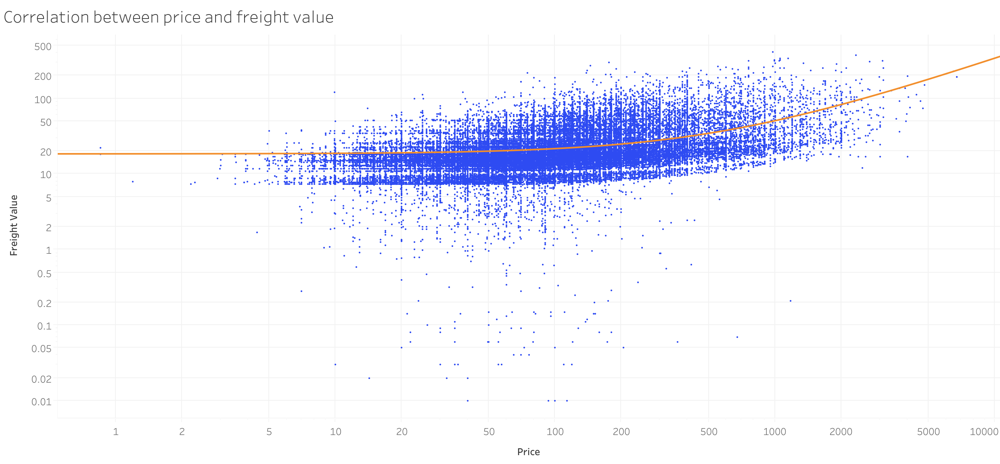

### 2. Relación entre Peso del Producto y Valor del Envío

-Hipótesis: "El valor del envío está positivamente correlacionado con el peso del producto."

-Razonamiento: Productos más pesados pueden costar más para ser enviados, ya que el costo del transporte suele aumentar con el peso.

Un coeficiente de correlación de 0.61 entre el product_weight_g (peso del producto) y el freight_value (valor del envío) indica una correlación positiva moderada a fuerte.

-Correlación Positiva Moderada a Fuerte: El coeficiente de 0.61 sugiere una relación positiva significativa entre el peso del producto y el valor del envío. Esto implica que, en general, a medida que el peso del producto aumenta, el coste del envío también tiende a aumentar.

-Relación General: Aunque el coeficiente indica una relación positiva, no es una correlación perfecta. Esto significa que, mientras hay una tendencia general de que un mayor peso esté asociado con un mayor coste de envío, la relación no es absoluta y hay variabilidad. Otros factores pueden influir en el valor del envío además del peso.

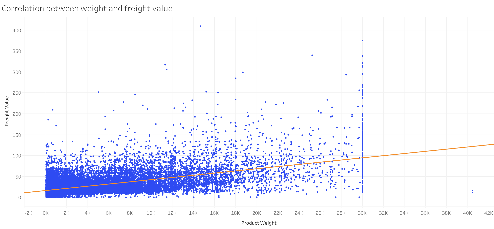

### 3. Relación entre Número de Fotos y Longitud de la Descripción del Producto

-Hipótesis: "Los productos con descripciones más largas tienden a tener un mayor número de fotos asociadas."

•	Razonamiento: Un producto con una descripción más detallada puede necesitar más fotos para proporcionar una vista completa del producto al cliente.

Un coeficiente de correlación de 0.11 entre el número de fotos y la longitud de la descripción sugiere una correlación positiva muy débil entre estas dos variables. Esto significa que, en general, no hay una relación fuerte o significativa entre la longitud de la descripción del producto y el número de fotos asociadas.

### 4. Relación entre Número de Cuotas y Valor del Pago

-Hipótesis: "Los clientes que optan por pagar en más cuotas tienden a realizar compras de mayor valor."
• Razonamiento: Los clientes pueden elegir pagar en más cuotas para facilitar el pago de productos más caros, ya que los costos se distribuyen a lo largo del tiempo.
Un coeficiente de correlación de 0.33 entre el número de cuotas y el valor del pago sugiere una correlación positiva moderada. Esto implica que hay una tendencia general a que los pagos en más cuotas estén asociados con valores de pago más altos, aunque la relación no es extremadamente fuerte.

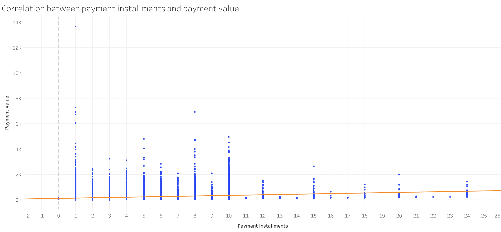

### 5. Relación entre cantidad de fotos y número de órdenes.

-Hipótesis: "Los productos con más fotos generan más ventas."
• Razonamiento: Los clientes pueden tomar la decisión de comprar un producto, si tienen más imágenes del mismo.

Un coeficiente de correlación de 0.01 entre el número de fotos y la longitud de la descripción sugiere una correlación casi inexistente entre estas dos variables. Esto significa que, en general, no hay una relación significativa entre la cantidad de fotos y las ventas, siendo el promedio de fotos de 2,19 por producto.

## VARIABLES CATEGÓRICAS VS CATEGÓRICAS

### 1. Relación entre Estado del Cliente y Estado del Pedido

-Hipótesis: "Los pedidos de clientes ubicados en ciertos estados tienen una mayor probabilidad de ser entregados tarde o ser cancelados."

•	Razonamiento: Las variaciones en la logística y los servicios de envío pueden afectar la puntualidad de las entregas en diferentes estados.

Dominio de Pedidos Entregados (delivered):
En todos los estados, la mayoría de los pedidos han sido entregados. Esto es indicativo de un sistema logístico eficiente, donde la mayoría de los pedidos completan el ciclo de compra. São Paulo (SP) destaca significativamente, con 6,168 pedidos entregados, seguido por Minas Gerais (MG) con 1,812 entregas, lo que sugiere que estos estados tienen una alta actividad de compras en línea.
Cancelaciones (canceled) Relativamente Bajas:
Las cancelaciones son bajas en comparación con las entregas en todos los estados. El número más alto de cancelaciones se encuentra en São Paulo (SP) con 21 pedidos cancelados, seguido por Minas Gerais (MG) con 11 cancelaciones. Esto podría ser un reflejo de la satisfacción del cliente o de un proceso de compra bien gestionado en estos estados.
Estados con Mayor Actividad Comercial:
São Paulo (SP) es, con diferencia, el estado con la mayor cantidad de transacciones en todas las categorías de estado de pedido, incluyendo 6,168 entregas, 21 cancelaciones, y otros estados como invoiced, processing y shipped también con cifras superiores a otros estados. Minas Gerais (MG) y Rio de Janeiro (RJ) también muestran altos volúmenes de actividad, con más de 1,000 pedidos entregados cada uno.
Estados con Menor Actividad Comercial:
Roraima (RR), Amapá (AP), y Acre (AC) muestran la menor actividad en términos de cantidad de pedidos. Por ejemplo, Roraima (RR) solo tiene 26 pedidos entregados y 1 cancelado. Esto podría estar relacionado con factores como menor densidad poblacional, menores tasas de adopción de comercio electrónico, o desafíos logísticos en estas áreas.
Procesamiento y Envío (processing y shipped):
Los estados con valores más altos en estas categorías (por ejemplo, São Paulo (SP) con 22 en processing y 74 en shipped) podrían indicar un volumen más alto de pedidos en tránsito o en espera de ser completados. Sin embargo, estas cifras son pequeñas comparadas con la cantidad de pedidos entregados, lo que sugiere que la mayoría de los pedidos avanzan rápidamente hacia la entrega.
Invoiced (invoiced):
Los estados de São Paulo (SP) y Minas Gerais (MG) tienen una ligera cantidad de pedidos que han sido facturados pero no entregados, lo que podría reflejar pedidos en una etapa intermedia entre la compra y la entrega.
Estados con Valores Específicos de Interés:
Goiás (GO) muestra una cantidad relativamente alta de cancelaciones (8) en comparación con otros estados con volúmenes de pedidos similares, lo que podría merecer una revisión más detallada para identificar posibles problemas.
Tasa de cancelación:
Los Estados con mayor tasa de cancelación son: RR (Roraima) (3.571429), AC (Acre) (2.325581),RN (Rio Grande do Norte) (1.449275), AM (Amazonas) (1.398601), TO (Tocatints)(1.104972), GO (Goiás) (1.037613)

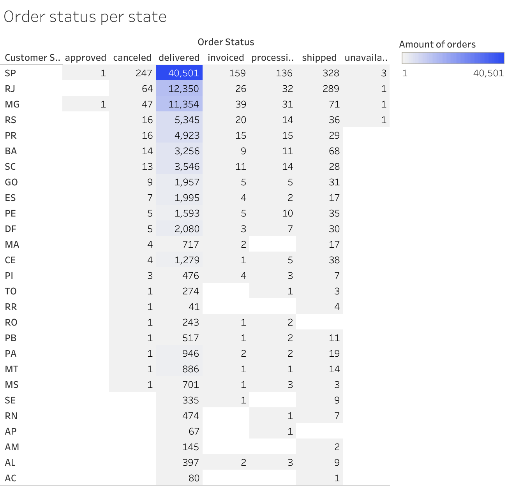

### 2. Relación entre Estado del Pedido y Método de Pago

-Hipótesis: "Los pedidos pagados en efectivo tienen una mayor probabilidad de ser cancelados en comparación con los pedidos pagados con tarjeta de crédito."

• Razonamiento: Los pagos en efectivo pueden estar asociados con mayores riesgos de cancelación o problemas en la entrega.

Proporción de Cancelaciones:
Pagos con boleto: De los 18,779 pedidos realizados con este método, 84 fueron cancelados. Esto representa aproximadamente un 0.45% de cancelaciones. Pagos con tarjeta de crédito: Se registraron 71,297 pedidos, de los cuales 347 fueron cancelados, lo que representa un 0.49% de cancelaciones. Pagos con voucher: De los 5,477 pedidos realizados con voucher, 27 fueron cancelados, lo que representa alrededor del 0.49% de cancelaciones. Pagos con tarjeta de débito: De los 1,453 pedidos, solo 3 fueron cancelados, lo que representa aproximadamente un 0.21%. Insight: La hipótesis de que los pagos en efectivo (boleto) tienen una mayor probabilidad de ser cancelados no se confirma con estos datos, ya que el porcentaje de cancelaciones es similar al de otros métodos como tarjetas de crédito y vouchers.
Tasa de Entrega:
Pagos con boleto: La mayoría de los pedidos (98%) realizados con boleto fueron entregados con éxito (18,391 de 18,779). Pagos con tarjeta de crédito: El 99% de los pedidos fueron entregados (71,297 de 71,303). Pagos con voucher: Un 98% de los pedidos se entregaron (5,365 de 5,477). Pagos con tarjeta de débito: Un 98% de los pedidos se entregaron (1,422 de 1,453). Insight: Todos los métodos de pago tienen tasas de entrega muy altas, lo que indica que independientemente del método de pago, los pedidos tienen una alta probabilidad de ser entregados.
Pedidos Procesados y Facturados:
Pagos con boleto: 55 pedidos fueron facturados y 53 están en proceso. Pagos con tarjeta de crédito: 230 pedidos fueron facturados y 229 están en proceso. Pagos con voucher: 20 pedidos fueron facturados y 12 están en proceso. Insight: La proporción de pedidos en proceso o facturados es baja en comparación con los pedidos entregados, lo que sugiere que la mayoría de los pedidos avanzan rápidamente a la fase de entrega, independientemente del método de pago.
Pedidos No Disponibles:
Pagos con tarjeta de crédito: Se registraron 6 pedidos como "unavailable". Insight: El estado "unavailable" es extremadamente raro y solo se presenta en un pequeño número de pedidos pagados con tarjeta de crédito. Esto podría indicar problemas específicos con este método que requieren más investigación.

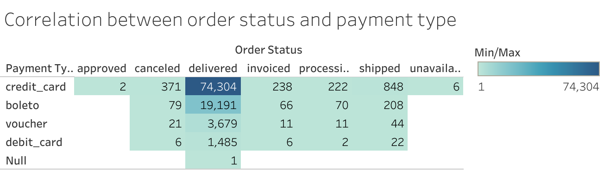

### 3. Relación entre Estado del Cliente y Estado del Vendedor

-Hipótesis: Es más probable que las ventas ocurran dentro del mismo estado (es decir, el cliente y el vendedor se encuentran en el mismo estado).

-Razonamiento: Los clientes pueden preferir comprar productos de vendedores locales para reducir los tiempos de envío y costos adicionales.

Tendencia Local de Compra
Estados con alta concentración de ventas: Los estados de São Paulo, Minas Gerais y Río de Janeiro muestran un alto número de transacciones tanto para compradores como para vendedores. Esto sugiere que estos estados tienen una actividad comercial significativa, con São Paulo destacándose como el estado con la mayor cantidad de transacciones. Tendencia a comprar dentro del estado: Los estados como São Paulo y Minas Gerais no solo tienen un alto número de transacciones en total, sino que también tienen un número considerable de transacciones dentro del mismo estado. Esto indica que los clientes en estos estados prefieren comprar a vendedores locales.
Estados con Baja Actividad
Estados con muy pocas transacciones: Algunos estados como Acre, Amapá, Roraima y Rondônia tienen muy pocas transacciones en comparación con otros estados. Esto puede indicar una menor actividad comercial en estos estados o una falta de vendedores en esas regiones.
Desbalance en la Distribución
Transacciones desiguales: Algunos estados como São Paulo y Minas Gerais tienen un número significativamente mayor de transacciones en comparación con estados como Rondônia y Roraima, que tienen muy pocas. Esto puede reflejar desigualdades en la actividad económica o en la disponibilidad de productos.
Preferencias Regionales
Estado de mayor compra local: São Paulo y Río de Janeiro no solo tienen muchos compradores y vendedores, sino que también muestran un alto nivel de transacciones entre clientes y vendedores dentro del mismo estado. São Paulo, por ejemplo, tiene 801 transacciones de vendedores en el estado de São Paulo, y Río de Janeiro tiene 247.
Interacción Estado-Vendedor
Concentración de transacciones en ciertos estados: Los estados como Minas Gerais y São Paulo tienen un alto número de transacciones tanto de compradores como de vendedores, sugiriendo una red comercial densa y activa. Por otro lado, la Bahía muestra un alto número de transacciones desde vendedores pero menos hacia otros estados, indicando que podría ser un punto central para las ventas.
Otros Insights Específicos
El estado de Alagoas tiene solo 2 transacciones con vendedores en Minas Gerais, y ningún otro estado tiene transacciones destacadas. Esto puede indicar un mercado pequeño o emergente en Alagoas. Estados con gran número de transacciones fuera de su región: Minas Gerais y São Paulo tienen transacciones significativas en otros estados, lo cual indica que los vendedores en estos estados pueden tener un alcance nacional.

## ANÁLISIS BIVARIABLE Categóricas vs numéricas

### 1. Estado vs tiquet medio.
Se analizó la relación entre el estado de residencia de cada cliente con el tiquet medio, para conocer las regiones que más ingresos aportan. 
No parece que hubiera ninguna relación entre el estado y el tiquet medio. Para comprobar esto se plantea como hipótesis nula que no hay correlación entre las variables y como hipótesis alternativa que si hay diferencia. Para evaluar la probabilidad de la hipótesis nula se aplica el análisis de varianza (test ANOVA). La probabilidad de la hipótesis núla es de 1.6823315540794354e-173 por lo que queda descartada y se puede considerar que sí hay una relación entre el estado del cliente y el tiquet medio.

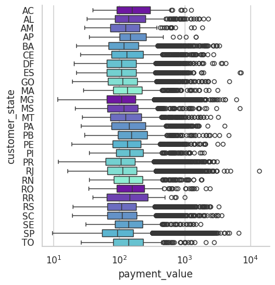

### 2. Valoración vs precio.
Se ha planteado la posibilidad de que los precios tengan una relación con las valoraciones de las compras. Para analizar esta hipótesis se ha graficado el dato en forma de diagrama de cajas, con lo que se evidencia la falta de relación entre las variables:

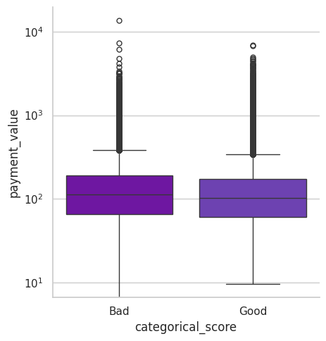

### 3. Relación entre Categoría del Producto y Método de Pago.

-Hipótesis: Ciertas categorías de productos, como los electrónicos o artículos de lujo, tienen una mayor probabilidad de ser pagados con tarjeta de crédito que con otros métodos de pago.

Razonamiento: Los productos de alto valor pueden estar más asociados con pagos a crédito debido a la facilidad de financiamiento.

Métodos de Pago Predominantes:
Tarjeta de Crédito: Es el método de pago más popular en la mayoría de las categorías de productos, con números significativamente altos en categorías como Accesorios de Computadora, Belleza y Salud, y Muebles de Decoración.
Boleto: Predomina en categorías con alta demanda de productos de gran volumen y bajo costo inicial, como Baño y Mesa de Cama y Belleza y Salud.
Tarjeta de Débito: Menos utilizada en comparación con la tarjeta de crédito, pero aún significativa en productos como Muebles de Decoración y Ocio Deportivo.
Voucher: Se utiliza de manera destacada en productos como Regalos y Muebles de Decoración, lo que puede indicar promociones o descuentos aplicados.
Categorías Populares por Método de Pago:
Accesorios de Computadora: Alta utilización de la tarjeta de crédito (5464) y también del boleto (1474), indicando un perfil de compra flexible que combina métodos de pago.
Belleza y Salud: Predomina el uso de la tarjeta de crédito (6753) y también el voucher (525), reflejando una fuerte preferencia por pagos electrónicos y promociones.
Muebles de Decoración: Alto uso de tarjeta de crédito (5639) y voucher (445), con un notable uso de tarjeta de débito (124), mostrando un interés diverso en formas de pago.
Juguetes: También presenta un alto uso de tarjeta de crédito (2842) y un significativo uso de voucher (236), sugiriendo una combinación de compras regulares y promocionales.
Tendencias Específicas por Categoría:
Automotor: Alta utilización de la tarjeta de crédito (2781) y también una cantidad considerable con boleto (710), lo que puede sugerir que los consumidores están dispuestos a financiar productos de alto valor mediante crédito.
Ocio Deportivo: Amplio uso de tarjeta de crédito (5859) y voucher (461), posiblemente debido a la alta frecuencia de compras en esta categoría.
Muebles de Oficina: Significativa compra con tarjeta de crédito (1216) y un pequeño número de compras con voucher (73), mostrando un patrón de pago más tradicional.
Categorías con Uso Mínimo de Métodos de Pago:
Libros Importados: Muy bajo uso de todos los métodos de pago, con casi nada de actividad registrada, lo que puede indicar un bajo volumen de ventas o menor popularidad de estos productos en comparación con otros.

### 4. Relación entre la desviación entre la estimación de la fecha de entrega y la entrega real, y las valoraciones:

Se quizo evaluar la relación entre la desviación de la estimación de la entrega y las valoraciones de los clientes. La hipótesis inicial es que los clientes castigan en sus valoraciones los retrasos en las entregas. 
En primer lugar, se calculó la desviación como la diferencia en días entre la fecha estimada de entrega y la fecha de entrega real. Los números positivos indican una entreda adelantada, y los números negativos implican un retraso. 
Se plantea como hipótesis nula que los grupos entregas valoradas positivamente, y entregas valoradas negativamente, no tienen diferencias entre la desviación de la estimación, y se evaluó con el test de ANOVA la probabilidad de esta hipótesis. La probabilidad computada es de 0, por lo que se descarta la hipótesis nula; se concluye que si hay relación entre las variables. Para profundizar en el análisis se estudió la correlación entre las valoraciones numéricas y los días de retraso/adelanto, y se encontró una correlación positiva de 0,26.

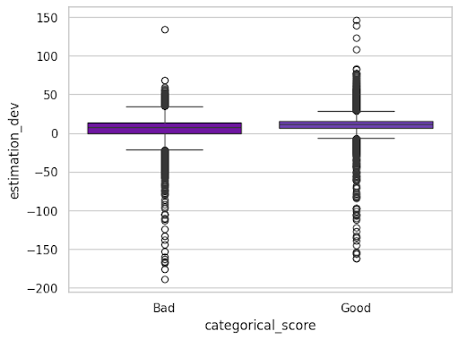
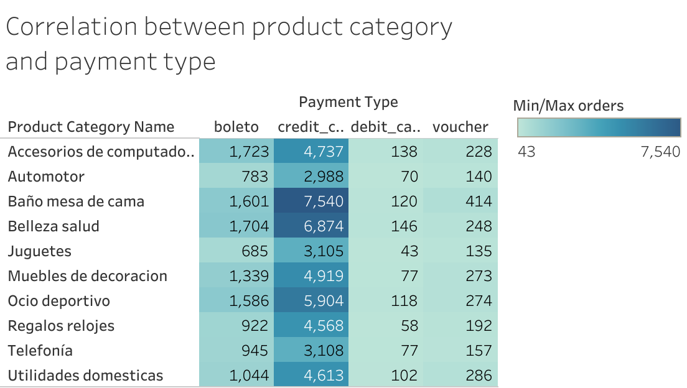
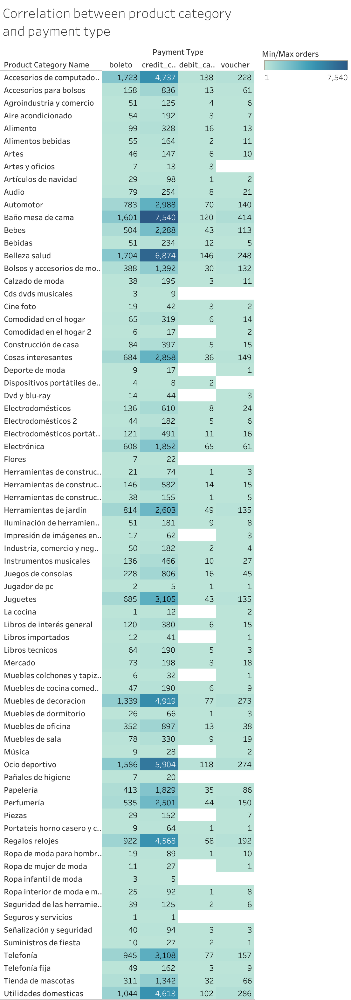

# RECOMENDACIONES:

Para Aumentar Ventas con Tarjeta de Débito y Voucher: Considerar incentivos adicionales o promociones para categorías donde estos métodos de pago tienen menor presencia.
Optimización de Métodos de Pago: Ajustar las estrategias de pago basadas en la popularidad de los métodos para cada categoría, como ofrecer más opciones de financiamiento para productos de alto valor.
Atención a Categorías con Bajo Uso de Métodos Definidos: Investigar las razones detrás del bajo uso de métodos de pago específicos, como posibles problemas de aceptación o falta de promoción adecuada.

Producto más vendido: Muebles de decoracion con 527 unidades vendidas.
Producto más caro: Utilidades domesticas con un precio de 6735.00 BRL.
Vendedor con mejor reputación: 003554e2dce176b5555353e4f3555ac8 con una puntuación promedio de 5.00.
Vendedor que más vende: 4869f7a5dfa277a7dca6462dcf3b52b2 con un total de ventas de 229472.63 BRL.

# ANÁLISIS DE TENDENCIAS DE VENTAS: TEMPORAL (MENSUAL/AÑO), POR CATEGORÍA DE PRODUCTO, Y GEOGRÁFICA.

Ventas mensuales anuales.

## Análisis Ventas totales por mes y por estacionalidad

Insights tendencias de ventas

Crecimiento general de las ventas:
-Tendencia creciente: Observamos un aumento significativo en las ventas desde septiembre de 2016 hasta aproximadamente noviembre de 2017. Este crecimiento parece ser continuo, con algunos meses experimentando un incremento considerable, por ejemplo, en noviembre de 2017, cuando las ventas alcanzan un pico de 1,010,271.37.
-Estabilización: A partir de diciembre de 2017, las ventas se mantienen en niveles altos, alrededor de 900,000 y 1,000,000, hasta mayo de 2018. Esto sugiere que después de un período de crecimiento rápido, las ventas alcanzaron un nivel de estabilidad.
Análisis de estacionalidad:
-Patrón anual: Es posible que exista estacionalidad en las ventas. Por ejemplo, se observan incrementos en ventas en meses como noviembre de 2017 y enero de 2018. Esto puede indicar un comportamiento estacional, quizás influenciado por las festividades de fin de año o eventos promocionales.
-Caídas en ventas: Notamos algunas caídas significativas en las ventas, como en septiembre de 2016 y septiembre de 2018. Estas caídas pueden estar asociadas con factores estacionales o eventos específicos de esos meses. Aún así, creemos que los datos de septiembre 2018 no son los correctos porque la caída es muy grande y justo es donde terminan nuestros datos.
Picos significativos:
-Noviembre de 2017: Es el mes con el mayor valor de ventas registrado, con 1,010,271.37. Este pico podría ser un outlier o podría estar relacionado con algún evento especial, como promociones o lanzamientos de productos.
-Diciembre de 2016 y septiembre de 2018: Estos meses presentan valores de ventas inusualmente bajos (10.90 y 145.00, respectivamente), lo que podría ser el resultado de errores en la captura de datos, interrupciones en las operaciones, o situaciones excepcionales como hemos comentado anteriormente.
Cambios abruptos:
-Octubre de 2016: Hay un salto repentino en las ventas desde septiembre de 2016 (267.36) hasta octubre de 2016 (49,507.66). Este cambio abrupto sugiere una posible mejora en las operaciones de venta, un aumento en la demanda, o un cambio estratégico en la fijación de precios o promoción.
-Enero de 2017: Otro salto considerable se observa entre diciembre de 2016 (10.90) y enero de 2017 (120,312.87). Esta variación sugiere que diciembre de 2016 podría haber sido un mes atípico o que hubo un evento positivo significativo en enero de 2017 (festividad navideña y próximos carnavales en cada febrero).
Estabilidad y desaceleración:
-Periodo 2017-2018: Desde septiembre de 2017 hasta mayo de 2018, las ventas muestran una tendencia a mantenerse altas, lo que sugiere un período de estabilidad tras el crecimiento observado previamente.
-Post mayo de 2018: Aunque los datos disponibles terminan en septiembre de 2018, observamos una disminución drástica en ventas en ese mes, lo que podría indicar el inicio de una desaceleración o un evento disruptivo que afectó negativamente las ventas.
Análisis de puntos atípicos (outliers):
-Septiembre de 2016 y septiembre de 2018: Son meses con ventas significativamente bajas, lo que contrasta fuertemente con los meses anteriores y posteriores. Es importante investigar si estos son errores en los datos o si realmente hubo circunstancias extraordinarias en esos períodos.

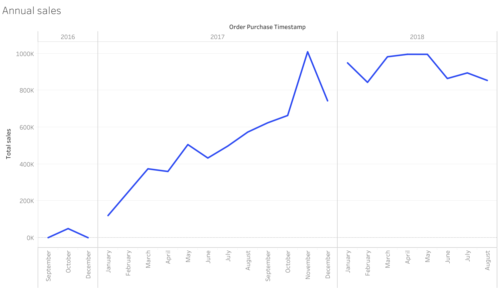

## RECOMENDACIONES PARA EL ANÁLISIS ADICIONAL

Descomposición de la serie temporal: Para separar y analizar componentes de tendencia, estacionalidad y ruido. Análisis de correlación con eventos externos: Como promociones, lanzamientos de productos, o cambios económicos que podrían estar correlacionados con los picos y caídas en las ventas. Modelado predictivo: Basado en los datos de ventas pasados para prever futuras ventas y planificar estrategias de negocio.

## Análisis de Ventas por Categoría de Producto

Visión General de Ventas por Categoría.

Aquí están los ingresos totales por cada una de las 8 categorías de productos más vendidas (en BRL, REAL BRASILEÑO):
Belleza y salud: R$1.247.137,68
Regalos y relojes: R$1.193.012,75
Ocio deportivo: R$980.529,82
Baño y mesa de cama: R$1.029.350,69
Accesorios de computadora: R$903.870,74
Muebles de decoración: R$724.317,65
Utilidades domésticas: R$626.926,38
Cosas interesantes: R$632.343,13

-Insight: La categoría "Belleza salud" es la que más ingresos ha generado, seguida de cerca por "Regalos relojes" y "Baño mesa de cama". Las categorías con menos ingresos son "Cosas interesantes" y "Utilidades domésticas".

## Análisis de Tendencias por Categoría

-Accesorios de computadora: Hay una tendencia de crecimiento en 2017, con picos en los meses de verano y finales del año.
-Baño mesa de cama: Las ventas son estables pero con picos en ciertos meses. La categoría muestra una tendencia de crecimiento, especialmente a finales de 2017.
-Belleza salud: Esta categoría tiene una tendencia de crecimiento muy fuerte a lo largo del tiempo, con picos significativos, especialmente en 2018.
-Cosas interesantes: Las ventas muestran variaciones mensuales, con ciertos meses que tienen un rendimiento notablemente alto.
-Muebles de decoración: Las ventas son más variables, con algunos picos en el año, pero sin una tendencia clara de crecimiento.
-Ocio deportivo: Las ventas muestran una tendencia de crecimiento a lo largo del tiempo, con picos en algunos meses.
-Regalos relojes: Las ventas muestran una fuerte tendencia de crecimiento con picos en los últimos meses de 2017 y principios de 2018.
-Utilidades domésticas: Las ventas son relativamente estables, con algunos picos pero sin una tendencia clara de crecimiento.

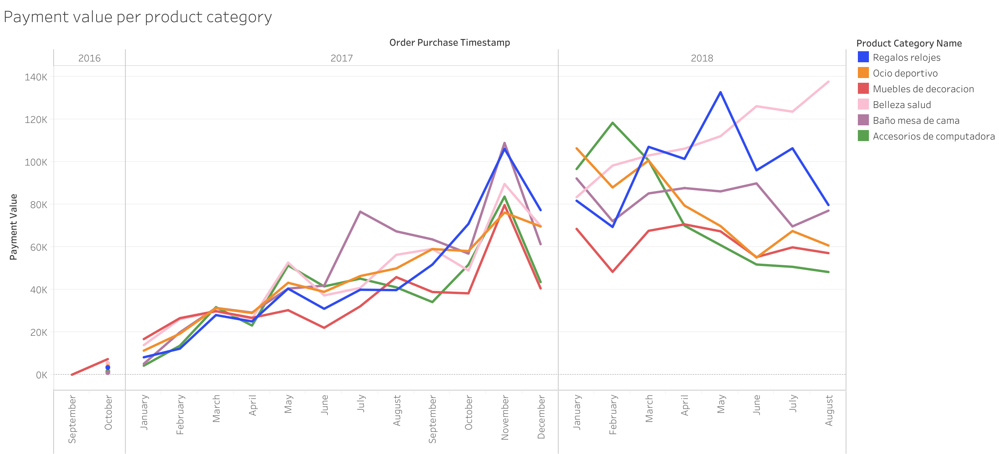

## CONCLUSIONES

Categorías Populares: Las categorías "Belleza salud" y "Regalos relojes" son las más exitosas en términos de ingresos totales, seguidas por "Ocio deportivo" y "Baño mesa de cama".
Tendencias Temporales: Algunas categorías como "Accesorios de computadora" y "Ocio deportivo" muestran una tendencia clara de crecimiento, mientras que otras como "Muebles de decoración" tienen ventas más estables.
Oportunidades de Crecimiento: Las categorías que muestran una tendencia creciente en ventas podrían beneficiarse de estrategias de marketing adicionales para aprovechar la tendencia positiva.

## Análisis Geográfico de Ventas

Ventas por Estado a lo largo del tiempo (los 10 Estados más importantes)

 **São Paulo**

Mes con más ventas: Noviembre 2017 (78,958.21 BRL)

Tendencias: São Paulo presenta un crecimiento continuo en ventas durante 2017, con picos en noviembre y diciembre. Las ventas siguen siendo elevadas en 2018, con algunas fluctuaciones menores.

 **Minas Gerais**

Mes con más ventas: Noviembre 2017 (125,891.62 BRL)

Tendencias: Minas Gerais muestra picos altos en ventas desde julio 2017, con el punto más alto en noviembre 2017. Las ventas permanecen elevadas en 2018 con fluctuaciones menores.

**Rio de Janeiro**

Mes con más ventas: Diciembre 2017 (67,057.68 BRL)

Tendencias: Las ventas en Río de Janeiro aumentan significativamente en diciembre 2017, con una tendencia ascendente constante desde principios de 2017. Las ventas siguen siendo altas en 2018, aunque con ligeras fluctuaciones.

**Ceará**

Mes con más ventas: Enero 2018 (24,404.72 BRL)

Tendencias: Las ventas muestran un crecimiento significativo desde principios de 2017, con picos importantes en noviembre 2017 y enero 2018. Luego hay una caída en la primavera de 2018, pero las ventas se mantienen relativamente altas.

**Bahia**

Mes con más ventas: Diciembre 2017 (35,731.82 BRL)

Tendencias: Las ventas en Bahia muestran picos continuos desde junio 2017, alcanzando el punto máximo en diciembre 2017 y enero 2018. Las ventas disminuyen ligeramente en los meses siguientes, con algunos picos de recuperación a mediados de 2018.

**Distrito Federal**

Mes con más ventas: Febrero 2018 (25,443.50 BRL)

Tendencias: Las ventas en el Distrito Federal muestran un fuerte aumento desde finales de 2017, con picos en febrero 2018 y abril 2018. Hay una tendencia ascendente con algunas fluctuaciones, y una caída en los meses de verano de 2018.

**Paraná**

Mes con más ventas: Noviembre 2017 (18,543.52 BRL)

Tendencias: Paraná presenta un crecimiento constante con picos en noviembre 2017 y diciembre 2017. Las ventas se mantienen relativamente estables con algunas fluctuaciones menores durante 2018.

**Pernambuco**

Mes con más ventas: Noviembre 2017 (26,119.49 BRL)

Tendencias: Las ventas en Pernambuco aumentan significativamente desde mediados de 2017, con picos en noviembre 2017 y enero 2018. Las ventas son consistentemente altas, con algunas fluctuaciones menores en el primer semestre de 2018.

**Goiás**

Mes con más ventas: Marzo 2018 (27,908.99 BRL)

Tendencias: Goiás muestra una tendencia ascendente con picos en marzo 2018 y junio 2018. Las ventas suben considerablemente en 2017 y alcanzan su punto máximo en la primavera de 2018, con fluctuaciones menores durante el año.

**Amazonas**

Mes con más ventas: Diciembre 2017 (3,342.98 BRL)

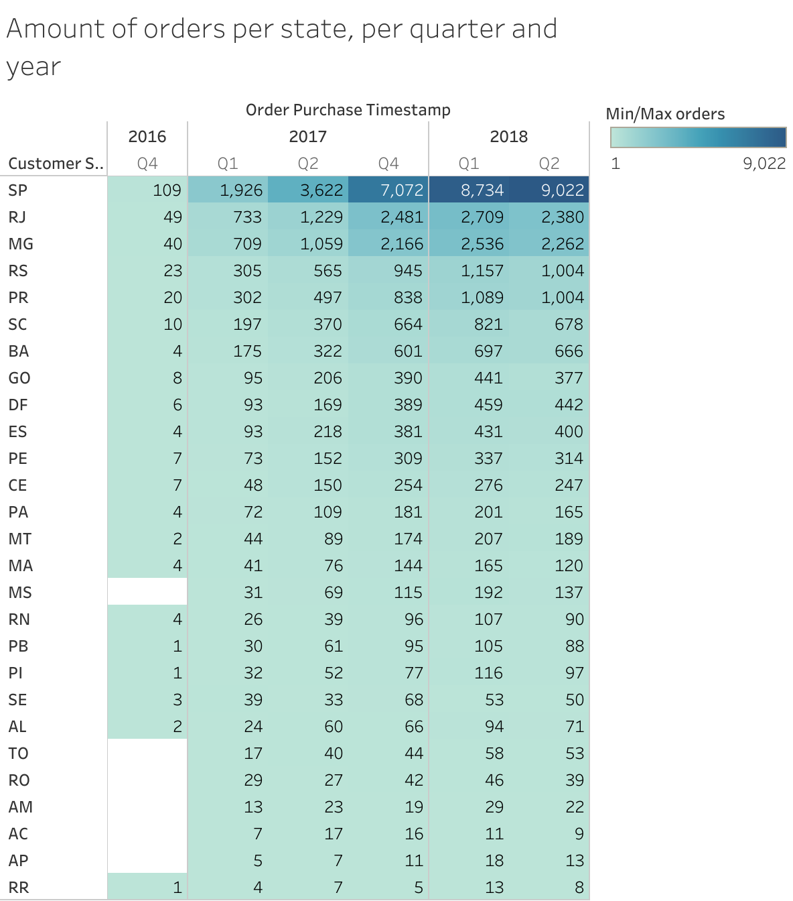

## TENDENCIAS

Las ventas en Amazonas tienen picos en diciembre 2017 y agosto 2018. Muestran cierta estabilidad con fluctuaciones a lo largo de los meses, pero los valores altos se concentran hacia el final de 2017 y verano de 2018.

## CONCLUSIONES

São Paulo y Minas Gerais como Líderes: São Paulo y Minas Gerais se destacan claramente como los estados con las ventas más altas. São Paulo mantiene un nivel de ventas consistente y alto a lo largo de 2017 y 2018, mientras que Minas Gerais presenta picos significativos en ventas, especialmente en noviembre 2017. Ambos estados muestran una fuerte presencia en el mercado, sugiriendo que son mercados clave para cualquier estrategia de ventas.

Picos en el Fin del Año: La mayoría de los estados muestran un incremento notable en las ventas hacia el final de 2017, con picos en noviembre y diciembre. Esto sugiere una estacionalidad en el mercado que podría estar vinculada a eventos de compras de fin de año, promociones o campañas específicas que atraen a más consumidores durante estos meses.

Fluctuaciones en 2018: A partir de 2018, varios estados experimentan fluctuaciones en las ventas, con algunos picos en meses específicos como enero y marzo. Esto indica que las ventas pueden estar influenciadas por factores estacionales, promociones o cambios en el comportamiento del consumidor a lo largo del año.

Crecimiento y Estabilidad Regional: Estados como Ceará, Bahia y Pernambuco muestran un crecimiento significativo en 2017 con picos en noviembre y diciembre. Aunque las ventas en estos estados son elevadas, también experimentan fluctuaciones en 2018. Esto puede indicar un mercado en expansión pero con variabilidad en la demanda.

Diferencias Regionales: Los estados del Norte y Nordeste, como Amazonas y Pernambuco, tienen patrones de ventas distintos comparados con los del Sudeste, como São Paulo y Río de Janeiro. Esto sugiere que las estrategias de venta y marketing podrían necesitar ajustes específicos para adaptarse a las diferencias regionales en el comportamiento del consumidor.

Importancia de las Estrategias de Fin de Año: La concentración de ventas altas en noviembre y diciembre resalta la importancia de planificar estrategias de marketing y ventas que capitalicen las oportunidades de fin de año. Las campañas dirigidas a maximizar las ventas durante estos meses podrían ser particularmente efectivas.

# Segmentación de clientes

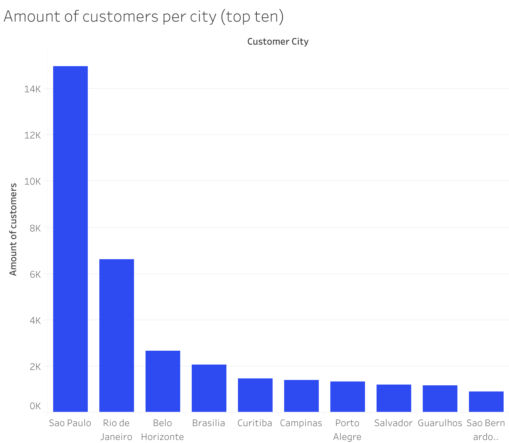
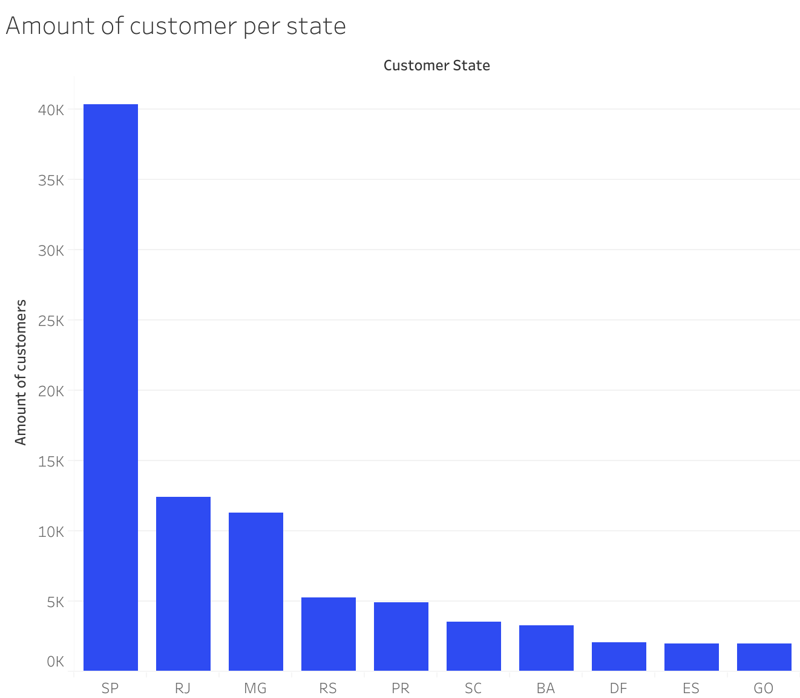
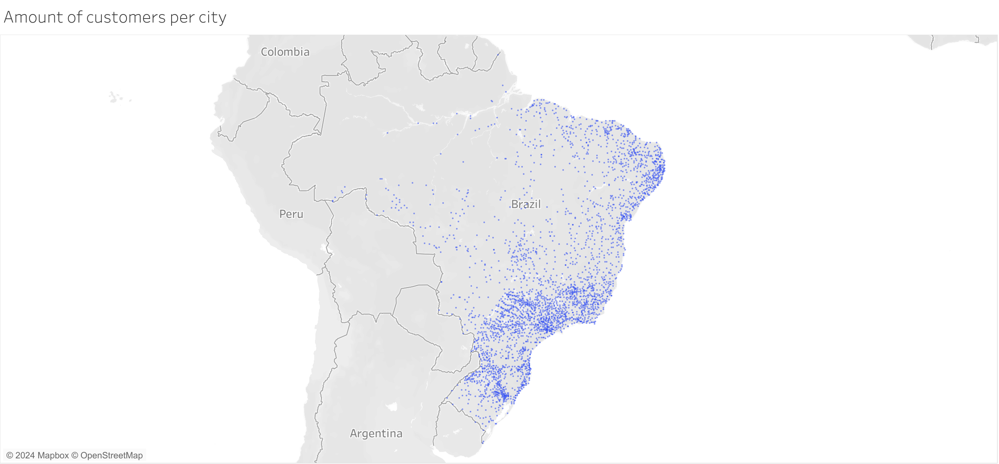

## Segmentación de clientes
Se ha hecho la segmentación de los clientes en tres niveles:
Nivel frecuencia de compra: Para el cálculo de la frecuencia de compra se ha calculado el tiempo pasado entre cada compra con su compra siguiente para cada cliente y se ha asignado el valor medio en días dividido entre el tiempo pasado entre la primera compra y la última como frecuencia de compra de cada cliente. 
Ticket promedio: Se ha calculado el ticket medio de cada cliente y se ha visualizado mediante un gráfico de densidad la distribución.
Categoría preferida: para cada cliente se ha buscado la categoría de producto con más compras. 

## Análisis de sentimientos de reviews 
Se cargan todos los datos desde el parquet guardado anteriormente respetando los type de cada uno de los df. 
Luego se carga el pipeline de análisis de sentimientos con un modelo multilingüe de Hugging Face para leer texto en español
classifier = pipeline('sentiment-analysis', model='nlptown/bert-base-multilingual-uncased-sentiment')
Una vez cargador el pipeline se realiza la funcion para analizar sentimiento solo si la reseña no está vacía y se aplica el análisis de sentimientos a las reseñas obteniendo el sentiment y el sentiment score.
Se realiza un mapeo del sentiment ya que el mismo estaba definido como 1 stars, 2 stars, 3 stars, 4 stars and 5 stars para solo definirlo del 1 al 5 
Luego se hace un segundo mapeo donde del 1 al 3 inclusive la reseña se considera negativa y del 4 al 5 positiva
Score difference
El objetivo es medir la diferencia entre el Review score original y el sentiment mapped obtenido del modelo para luego obtener una distribucion de las diferencias 

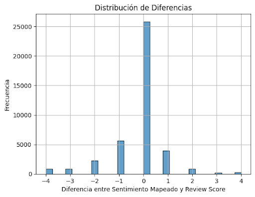

Se obtiene que la media de las diferencias es -0,22 
Identificar Casos con Diferencias Significativas:
- Score_difference: Calcula la diferencia entre el sentimiento mapeado y la puntuación real. Un valor positivo indica que el sentimiento mapeado es más alto que la puntuación real, y un valor negativo indica lo contrario.
- Análisis de la Diferencia: Describir, visualizar y calcular la media de las diferencias ayuda a comprender cómo se alinea el análisis de sentimientos con las valoraciones reales.
- Identificación de Discrepancias: Identificar y analizar casos con discrepancias significativas puede revelar inconsistencias o patrones interesantes en los datos.

## Matriz de confusión

- Aciertos: El modelo parece funcionar razonablemente bien para la clase "5", donde se observan la mayoría de las predicciones correctas (17238). También hay una cantidad decente de aciertos en la clase "1" (9347).
- Errores: Hay errores notables en las clases "2", "3", y "4", donde el modelo parece confundir con frecuencia las clases adyacentes. Por ejemplo, hay una cantidad significativa de reseñas con un sentimiento verdadero de "4" que fueron clasificadas como "5" y viceversa.

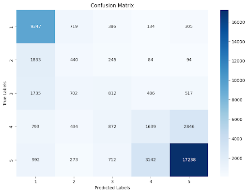

## Análisis por Categoría de Producto 
Se obtiene el top 5 de categorias de productos mas vendidos y se compara con el sentimet_mapped
Top 5 categorías de productos más vendidos:
1. Baño mesa de cama con 11115 unidades vendidas.
2. Belleza salud con 9670 unidades vendidas.
3. Ocio deportivo con 8641 unidades vendidas.
4. Muebles de decoracion con 8334 unidades vendidas.
5. Accesorios de computadora con 7827 unidades vendidas.

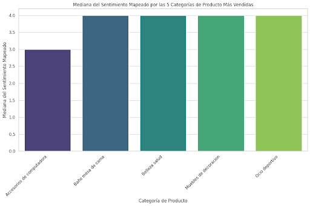
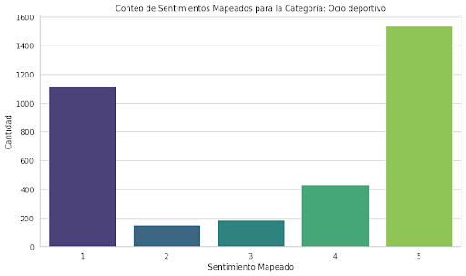

Se obtiene el número de reseñas por categoria de producto y se relaciona con el sentiment_mapped

## Correlación entre sentiment_mapped y review_score
Una correlación de 0.80 entre las columnas sentiment_mapped y review_score indica una fuerte relación positiva entre las dos variables. Lo que indica que el modelo entrenado es bastante certero

## Correlación entre sentiment mapped y delivery time
Se realizó el cálculo de estimation_dev restando order_estimated_delivery_date y order_delivered_customer_date
Y dio una correlación de 0.19, significa que hay una leve relación positiva: a medida que aumenta el estimation_dev (la desviación en el tiempo de entrega), el sentimiento mapeado tiende a mejorar ligeramente, pero esta relación no es lo suficientemente fuerte como para sacar conclusiones definitivas. Podría ser una coincidencia o una tendencia muy leve, por lo que no deberías confiar mucho en esta relación sin analizar más datos.
Esto no era esperable ya que a mayor cantidad de dias sobre lo estimado probablemente el cliente haga una mala reseña pero es posible que sus reseñas se basen más en el producto en si que en los tiempos de entrega.

## Tabla RFM
Por último se realizó una tabla de recency, frequency  y monetary.
La segmentación de clientes esta basada en el puntaje RFM (Recency, Frequency, Monetary) asignado a cada cliente. La segmentación está determinada por el valor de rfm_score, que es una combinación de las métricas RFM. El puntaje es una concatenación de tres valores (por ejemplo, "444"), donde:
Recency: Cuán recientemente un cliente ha comprado.
Frequency: La frecuencia con la que el cliente ha comprado.
Monetary: Cuánto ha gastado el cliente.
Donde pd.qcut(): Divide los datos de la columna Recency en 4 grupos cuartiles. La función qcut se utiliza para dividir los datos en partes iguales basándose en cuartiles.
- Recency: Hace referencia a la columna Recency, que mide el tiempo transcurrido desde la última compra. Cuanto menor es el valor, más reciente fue la compra.
4: Indica que se van a crear 4 grupos cuartiles.
4, 3, 2, 1: Asigna etiquetas a los grupos resultantes. Un cliente con una compra reciente recibe un puntaje de 4, mientras que un cliente que no ha comprado en mucho tiempo recibe un puntaje de 1.
El resultado es una nueva columna r_score que clasifica a los clientes por recencia en base a cuartiles.
- Frequency .rank(method= 'first'): Aplica un ranking a la columna Frequency, que mide cuántas veces ha comprado un cliente. El método 'first' asegura que, en caso de empates, los clientes se ordenen según el primer valor encontrado.    
pd.qcut(..., 4, 1, 2, 3, 4): Divide los valores de la columna rankeada en 4 cuartiles. En este caso, los clientes con mayor frecuencia de compra reciben una puntuación de 4, mientras que los clientes con menor frecuencia de compra reciben una puntuación de 1.
El resultado es una nueva columna f_score que clasifica a los clientes por frecuencia de compra en base a cuartiles.
- Monetary: Hace referencia a la columna Monetary, que mide el valor monetario total gastado por un cliente.                                                    
pd.qcut(..., 4, 1, 2, 3, 4): Divide los valores de la columna en 4 cuartiles. Los clientes que han gastado más dinero reciben un puntaje de 4, y los que han gastado menos dinero reciben un puntaje de 1.
El resultado es una nueva columna m_score que clasifica a los clientes por valor monetario en base a cuartiles.

## Explicación de cada segmento:
- VIP (rfm_score = 444):
Estos clientes tienen los mejores puntajes en las tres dimensiones: Recency (4), Frequency (4), y Monetary (4).
Son los clientes más valiosos porque compran frecuentemente, han hecho una compra recientemente, y gastan mucho dinero.
- Very Loyal (433 ≤ rfm_score < 444):
Clientes muy leales que casi cumplen con los criterios de VIP.
Compran regularmente y han realizado compras recientemente, pero tal vez no gastan tanto como los VIP.
- Potential Loyalist (421 ≤ rfm_score < 433):
Clientes que muestran potencial para convertirse en leales.
Han comprado recientemente y con una frecuencia razonable, aunque pueden no gastar tanto como los Very Loyal.
- New Customers (344 ≤ rfm_score < 421):
Clientes que son nuevos, compraron recientemente, pero su frecuencia y monto gastado aún no son altos.
Se espera que con un buen seguimiento y marketing puedan moverse a categorías superiores como leales o VIP.
- Potential Customer (323 ≤ rfm_score < 344):
Clientes que tienen cierta actividad, pero no compran tan seguido ni gastan tanto.
Han hecho una compra reciente, lo que sugiere que hay potencial de crecimiento, pero podrían ser menos comprometidos con la marca.
- High Risk to Churn (224 ≤ rfm_score < 311):
Clientes que están en riesgo alto de abandonar la marca.
No han comprado recientemente o no lo hacen con frecuencia, y gastan menos. Se debe tomar acción para reactivarlos.
- Lost Customers (rfm_score < 224):
Clientes que probablemente ya se han perdido.
No han comprado en mucho tiempo, no gastan mucho y no lo hacen con frecuencia. Es muy difícil recuperarlos.

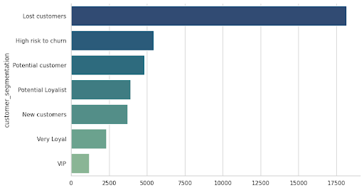
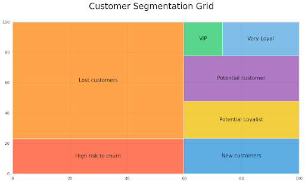

*esto esta basado solamente en clientes que tienen reviews 